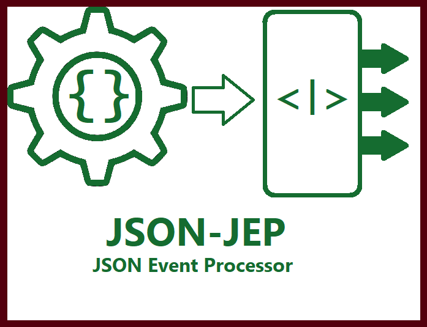

# JEP API GUIDE

* [Overview](./overview)
* [Getting Started](./getting-started)
    * [Creating an Event Handler](./creating-an-event-handler)
    * [Working with the JEP Object Model](./working-with-jep-objects)
    * [Factory Settings](./factory-settings)
* [Marshalling and Unmarshalling JSON and POJOs](./marshalling-unmarshalling-json-pojo)
* [Merging JSON instances](./merging)
